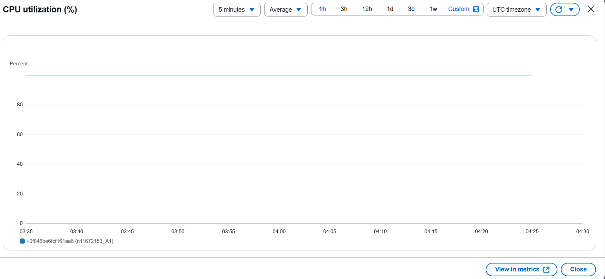

# Assignment 1 – REST API Project – Response to Criteria

**Name:** Aniket Khot  
**Student number:** n11672153  
**Application name:** CAB432 Video Transcoder  

**Two-line description:**  
A simple video service where users upload videos, trigger CPU-intensive ffmpeg transcodes (720p/480p), and download originals or variants. Auth is JWT; data includes unstructured files and structured metadata.

---

## Core criteria (20 marks)

### Containerise the app (3)
- **What:** App is packaged as a Docker image that includes Node 20 and ffmpeg.
- **Video timestamp:** `00:00` (Dockerfile shown)
- **Relevant files:**
  - `/Dockerfile`
  - `/.dockerignore` (to keep image small & clean)

---

### Deploy the container (3)
- **What:** Image pushed to ECR, pulled and run on EC2 (Ubuntu 24.04).
- **Video timestamp:** `00:11` (ECR repo + pull + run on EC2)

  - **ECR repository name:** n11672153
  - **EC2 instance ID:** i-0f846be6fcf161aa6

  

---

### REST API (3)
- **What:** REST endpoints for health, login, upload, list files, download, start transcode, get job status. Running on public IP.
- **Video timestamp:** `00:52` (app intro & endpoints; public IP shown)
- **Relevant files:**
  - `/src/index.ts`
  - `/src/routes/files.ts`
  - `/src/routes/transcode.ts`
  - `/src/routes/jobs.ts`

---

### User login (3)
- **What:** Hard-coded users `admin` with JWT sessions; protected routes require `Authorization`.
- **Video timestamp:** `02:20` (login/auth)
- **Relevant files:**
  - `/src/routes/auth.ts`
  - `/src/services/jwt.ts`

---

### Two kinds of data (3)

**First kind (Unstructured):**  
Uploaded videos and generated variants on disk under  
`/app/src/data/files/<fileId>/`.
- **Video timestamp:** `02:45`
- **Relevant files/dirs:**  
  `/src/routes/files.ts`, `/src/routes/transcode.ts`, `/src/data/` (runtime)  
  **Bind mount:** `/opt/cab432/data` = `/app/src/data`

**Second kind (Structured, no ACID):**  
JSON metadata for files and jobs (owner, names, sizes, job status, output paths) in `db.json`.
- **Video timestamp:** `02:45`
- **Relevant files:** `/src/services/db.ts` (simple JSON store)

---

### CPU-intensive task (3)
- **What:** `ffmpeg` transcode to 720p/480p,  Runs async; jobs move `queued , running ,  done|error`.
- **Video timestamp:** `03:52`
- **Relevant files:**
  - `/src/services/ffmpeg.ts` (fluent-ffmpeg + ffmpeg binary)
  - `/src/routes/transcode.ts` (job creation & background work)

---

### CPU load testing (2)
- **What:** Parallel requests to `/api/transcode` to sustain `>80%` CPU for ~5 minutes. Evidence via EC2 Monitoring `CPUUtilization` graph. it went to `100%` for half an hour 
- **Video timestamp:** `04:28`
- **Relevant files/scripts:**
  - `/scripts/load.ps1` (parallel POSTs)
  - *(Video shows EC2 `CPUUtilization` graph `>80%` over ~5 min)*
  - final SS 

